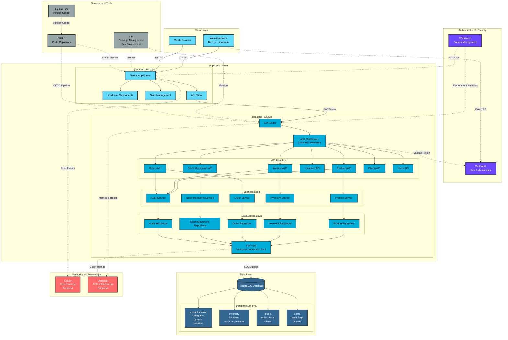

```mermaid
graph TB
    subgraph "Client Layer"
        WebApp[Web Application<br/>Next.js + shadcn/ui]
        Mobile[Mobile Browser]
    end

    subgraph "Authentication & Security"
        Clerk[Clerk Auth<br/>User Authentication]
        OnePassword[1Password<br/>Secrets Management]
    end

    subgraph "Application Layer"
        subgraph "Frontend - Next.js"
            NextApp[Next.js App Router]
            UIComponents[shadcn/ui Components]
            StateManagement[State Management]
            APIClient[API Client]
        end

        subgraph "Backend - Go/Gin"
            GinRouter[Gin Router]
            AuthMiddleware[Auth Middleware<br/>Clerk JWT Validation]

            subgraph "API Handlers"
                ProductsAPI[Products API]
                InventoryAPI[Inventory API]
                OrdersAPI[Orders API]
                LocationsAPI[Locations API]
                StockMovementAPI[Stock Movements API]
                ClientsAPI[Clients API]
                UsersAPI[Users API]
            end

            subgraph "Business Logic"
                ProductService[Product Service]
                InventoryService[Inventory Service]
                OrderService[Order Service]
                StockService[Stock Movement Service]
                AuditService[Audit Service]
            end

            subgraph "Data Access Layer"
                ProductRepo[Product Repository]
                InventoryRepo[Inventory Repository]
                OrderRepo[Order Repository]
                StockRepo[Stock Movement Repository]
                AuditRepo[Audit Repository]
            end

            DBConnection[sqlx + pq<br/>Database Connection Pool]
        end
    end

    subgraph "Data Layer"
        PostgreSQL[(PostgreSQL Database)]

        subgraph "Database Schema"
            Products[product_catalog<br/>categories<br/>brands<br/>suppliers]
            Inventory[inventory<br/>locations<br/>stock_movements]
            Orders[orders<br/>order_items<br/>clients]
            System[users<br/>audit_logs<br/>photos]
        end
    end

    subgraph "Monitoring & Observability"
        Sentry[Sentry<br/>Error Tracking<br/>Frontend]
        Datadog[Datadog<br/>APM & Monitoring<br/>Backend]
    end

    subgraph "Development Tools"
        Nix[Nix<br/>Package Management<br/>Dev Environment]
        JJ[Jujutsu + Git<br/>Version Control]
        GitHub[GitHub<br/>Code Repository]
    end

    %% Client connections
    WebApp -->|HTTPS| NextApp
    Mobile -->|HTTPS| NextApp

    %% Frontend internal flow
    NextApp --> UIComponents
    NextApp --> StateManagement
    NextApp --> APIClient

    %% Authentication flow
    WebApp -.->|OAuth 2.0| Clerk
    APIClient -->|JWT Token| GinRouter
    GinRouter --> AuthMiddleware
    AuthMiddleware -.->|Validate Token| Clerk

    %% API routing
    AuthMiddleware --> ProductsAPI
    AuthMiddleware --> InventoryAPI
    AuthMiddleware --> OrdersAPI
    AuthMiddleware --> LocationsAPI
    AuthMiddleware --> StockMovementAPI
    AuthMiddleware --> ClientsAPI
    AuthMiddleware --> UsersAPI

    %% Business logic connections
    ProductsAPI --> ProductService
    InventoryAPI --> InventoryService
    OrdersAPI --> OrderService
    StockMovementAPI --> StockService
    ProductsAPI --> AuditService
    InventoryAPI --> AuditService
    OrdersAPI --> AuditService

    %% Data access connections
    ProductService --> ProductRepo
    InventoryService --> InventoryRepo
    OrderService --> OrderRepo
    StockService --> StockRepo
    AuditService --> AuditRepo

    %% Database connections
    ProductRepo --> DBConnection
    InventoryRepo --> DBConnection
    OrderRepo --> DBConnection
    StockRepo --> DBConnection
    AuditRepo --> DBConnection

    DBConnection -->|SQL Queries| PostgreSQL

    %% Database schema relationships
    PostgreSQL --> Products
    PostgreSQL --> Inventory
    PostgreSQL --> Orders
    PostgreSQL --> System

    %% Secrets management
    OnePassword -.->|Environment Variables| GinRouter
    OnePassword -.->|API Keys| NextApp

    %% Monitoring connections
    NextApp -.->|Error Events| Sentry
    GinRouter -.->|Metrics & Traces| Datadog
    DBConnection -.->|Query Metrics| Datadog

    %% Development workflow
    Nix -.->|Manage| NextApp
    Nix -.->|Manage| GinRouter
    JJ -.->|Version Control| GitHub
    GitHub -.->|CI/CD Pipeline| NextApp
    GitHub -.->|CI/CD Pipeline| GinRouter

    %% Styling
    classDef frontend fill:#61dafb,stroke:#333,stroke-width:2px,color:#000
    classDef backend fill:#00add8,stroke:#333,stroke-width:2px,color:#000
    classDef database fill:#336791,stroke:#333,stroke-width:2px,color:#fff
    classDef auth fill:#6c47ff,stroke:#333,stroke-width:2px,color:#fff
    classDef monitoring fill:#ff6b6b,stroke:#333,stroke-width:2px,color:#fff
    classDef tools fill:#95a5a6,stroke:#333,stroke-width:2px,color:#000

    class WebApp,Mobile,NextApp,UIComponents,StateManagement,APIClient frontend
    class GinRouter,AuthMiddleware,ProductsAPI,InventoryAPI,OrdersAPI,LocationsAPI,StockMovementAPI,ClientsAPI,UsersAPI,ProductService,InventoryService,OrderService,StockService,AuditService,ProductRepo,InventoryRepo,OrderRepo,StockRepo,AuditRepo,DBConnection backend
    class PostgreSQL,Products,Inventory,Orders,System database
    class Clerk,OnePassword auth
    class Sentry,Datadog monitoring
    class Nix,JJ,GitHub tools
```
