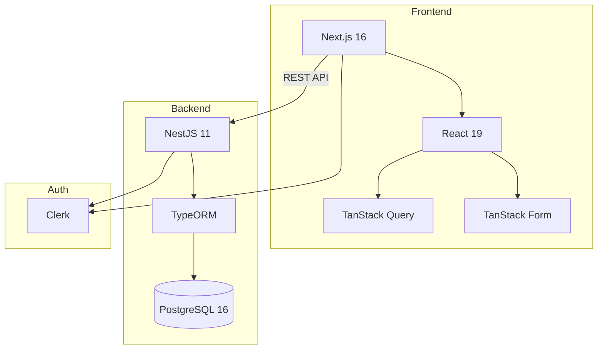

# Architecture

## Vue d'Ensemble du Système



## Stack Technique

| Couche | Technologie |
|--------|-------------|
| Frontend | Next.js 16, React 19, TanStack Query/Form, Tailwind CSS |
| Backend | NestJS 11, TypeORM, PostgreSQL 16 |
| Auth | Clerk |
| Docs API | OpenAPI/Swagger |
| Outillage | pnpm workspaces, devenv.sh, TypeScript |

## Structure du Monorepo

```
rbi/
├── modules/
│   ├── api/                 # @rbi/api - Backend NestJS
│   └── web/                 # @rbi/web - Frontend Next.js
├── packages/
│   ├── types/               # @rbi/types - Types TypeScript partagés
│   ├── tsconfig/            # Configs TS partagées
│   └── eslint-config/       # Config ESLint partagée
├── docs/                    # Documentation MkDocs
├── openapi.yaml             # Spec API générée
├── pnpm-workspace.yaml
├── mkdocs.yml               # Config documentation
└── devenv.nix               # Environnement dev Nix
```

## Flux de Données

```
┌─────────────────────────────────────────┐
│           Frontend Next.js              │
│  React Query ←── Orval (généré) ←───────┼── openapi.yaml
│  Auth Clerk                             │
└─────────────────────────────────────────┘
                    ▼ HTTP/REST
┌─────────────────────────────────────────┐
│            Backend NestJS               │
│  Controller → Service → Repository      │
│  ClerkAuthGuard · TypeORM · Swagger ────┼──► openapi.yaml
└─────────────────────────────────────────┘
                    ▼
┌─────────────────────────────────────────┐
│             PostgreSQL                  │
└─────────────────────────────────────────┘
```

## Flux d'Authentification

```
Utilisateur → Clerk → Token JWT
                        ↓
Frontend: Authorization: Bearer {token}
                        ↓
Backend: ClerkAuthGuard → vérifier → req.auth.userId
```

## Workflow OpenAPI-First

La spécification API est le contrat entre frontend et backend :

```bash
# 1. Le backend génère la spec depuis les décorateurs
pnpm --filter @rbi/api openapi:generate   # → openapi.yaml

# 2. Le frontend génère des hooks typés depuis la spec
pnpm --filter @rbi/web api:gen            # → src/lib/data/generated.ts
```

!!! warning "Toujours régénérer les deux après des modifications API"
    Le fichier `openapi.yaml` à la racine est la source de vérité pour le frontend.

## Patterns Clés

| Pattern | Emplacement | Objectif |
|---------|-------------|----------|
| Repository | `api/src/routes/*/` | Couche d'accès aux données |
| Service | `api/src/routes/*/` | Logique métier |
| BaseAuditEntity | `api/src/common/entities/` | Suppression douce + champs d'audit |
| ClerkAuthGuard | `api/src/common/guards/` | Vérification JWT |
| HATEOAS | `api/src/common/hateoas/` | Liens hypermédia REST |
| Hooks générés | `web/src/lib/data/generated.ts` | Appels API typés |
