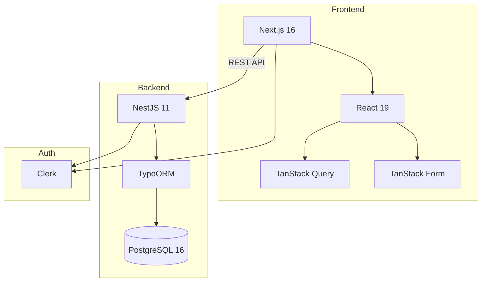

# Architecture

## System Overview



## Tech Stack

| Layer | Technology |
|-------|------------|
| Frontend | Next.js 16, React 19, TanStack Query/Form, Tailwind CSS |
| Backend | NestJS 11, TypeORM, PostgreSQL 16 |
| Auth | Clerk |
| API Docs | OpenAPI/Swagger |
| Tooling | pnpm workspaces, devenv.sh, TypeScript |

## Monorepo Structure

```
rbi/
├── modules/
│   ├── api/                 # @rbi/api - NestJS backend
│   └── web/                 # @rbi/web - Next.js frontend
├── packages/
│   ├── types/               # @rbi/types - Shared TypeScript types
│   ├── tsconfig/            # Shared TS configs
│   └── eslint-config/       # Shared ESLint config
├── docs/                    # MkDocs documentation
├── openapi.yaml             # Generated API spec
├── pnpm-workspace.yaml
├── mkdocs.yml               # Documentation config
└── devenv.nix               # Nix dev environment
```

## Data Flow

```
┌─────────────────────────────────────────┐
│           Next.js Frontend              │
│  React Query ←── Orval (generated) ←────┼── openapi.yaml
│  Clerk Auth                             │
└─────────────────────────────────────────┘
                    ▼ HTTP/REST
┌─────────────────────────────────────────┐
│            NestJS Backend               │
│  Controller → Service → Repository      │
│  ClerkAuthGuard · TypeORM · Swagger ────┼──► openapi.yaml
└─────────────────────────────────────────┘
                    ▼
┌─────────────────────────────────────────┐
│             PostgreSQL                  │
└─────────────────────────────────────────┘
```

## Authentication Flow

```
User → Clerk → JWT Token
                  ↓
Frontend: Authorization: Bearer {token}
                  ↓
Backend: ClerkAuthGuard → verify → req.auth.userId
```

## OpenAPI-First Workflow

The API specification is the contract between frontend and backend:

```bash
# 1. Backend generates spec from decorators
pnpm --filter @rbi/api openapi:generate   # → openapi.yaml

# 2. Frontend generates typed hooks from spec
pnpm --filter @rbi/web api:gen            # → src/lib/data/generated.ts
```

!!! warning "Always regenerate both after API changes"
    The `openapi.yaml` at repo root is the source of truth for the frontend.

## Key Patterns

| Pattern | Location | Purpose |
|---------|----------|---------|
| Repository | `api/src/routes/*/` | Data access layer |
| Service | `api/src/routes/*/` | Business logic |
| BaseAuditEntity | `api/src/common/entities/` | Soft delete + audit fields |
| ClerkAuthGuard | `api/src/common/guards/` | JWT verification |
| HATEOAS | `api/src/common/hateoas/` | REST hypermedia links |
| Generated hooks | `web/src/lib/data/generated.ts` | Type-safe API calls |
