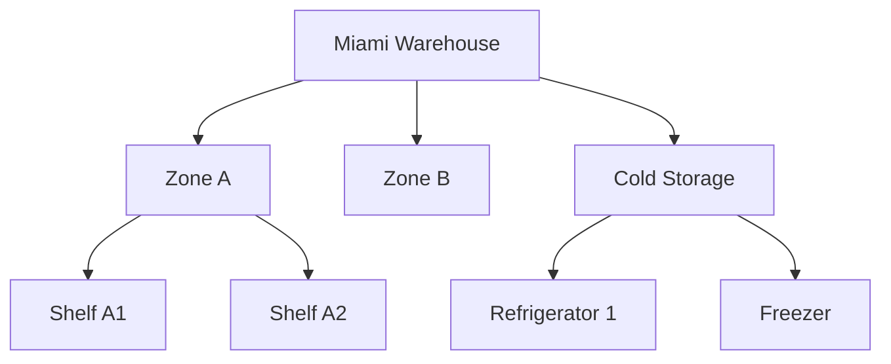

# Managing Areas

Areas represent specific zones, shelves, or bins within a Location. They provide granular placement tracking for inventory items.

## Understanding Areas

Areas are hierarchical and always belong to a Location:

```
Location: Miami Warehouse
├── Area: Zone A
│   ├── Area: Shelf A1
│   ├── Area: Shelf A2
│   └── Area: Shelf A3
├── Area: Zone B
│   └── Area: Shelf B1
└── Area: Cold Storage
    ├── Area: Refrigerator 1
    └── Area: Freezer
```

!!! info "Areas are Optional"
    Inventory can be tracked at just the Location level. Areas add precision when you need to know exactly where items are placed.

## Viewing Areas

Navigate to **Locations** → select a location → **View Areas** to see all areas within that location.

The area list displays:

- **Name** - Area identifier
- **Code** - Short code for quick reference
- **Parent** - Parent area (if nested)
- **Status** - Active or inactive

!!! tip "Hierarchical View"
    Toggle between flat list and tree view to see the area hierarchy.

## Creating an Area

1. Select a location
2. Click the **Create Area** button
3. Fill in the required fields:
   - **Name** - Area name (e.g., "Shelf A1")
   - **Code** - Short identifier (e.g., "A1")
   - **Parent** - Parent area for nesting (optional)

### Area Fields

| Field | Required | Description |
|-------|----------|-------------|
| Name | Yes | Area display name |
| Location | Yes | Parent location (auto-filled) |
| Parent Area | No | Parent area for hierarchy |
| Code | No | Short identifier code |
| Description | No | Additional details |
| Is Active | Yes | Area availability |

## Creating Nested Areas

To create a hierarchy:

1. Create the parent area first (e.g., "Zone A")
2. Create child areas with the parent selected (e.g., "Shelf A1" → Parent: "Zone A")
3. Continue nesting as deep as needed



## Editing Areas

1. Click on an area to open the edit form
2. Modify the fields as needed
3. Click **Save** to apply changes

!!! warning "Moving Areas"
    Changing an area's parent will move all its children as well. The area must stay within the same location.

## Deleting Areas

When you delete an area:

- **Child areas are also deleted** (cascade delete)
- **Inventory records lose their area reference** (set to null)
- The inventory remains at the location level

!!! danger "Cascade Delete"
    Deleting "Zone A" will also delete "Shelf A1", "Shelf A2", and all other nested areas.

## Best Practices

1. **Use consistent naming** - "Shelf A1" not "shelf-a1" or "SHELF A1"
2. **Use codes for quick lookup** - Short codes like "A1", "B2", "CS" help during inventory counts
3. **Don't over-nest** - 2-3 levels is usually sufficient (Zone → Shelf → Bin)
4. **Match physical layout** - Area structure should reflect the actual storage layout
