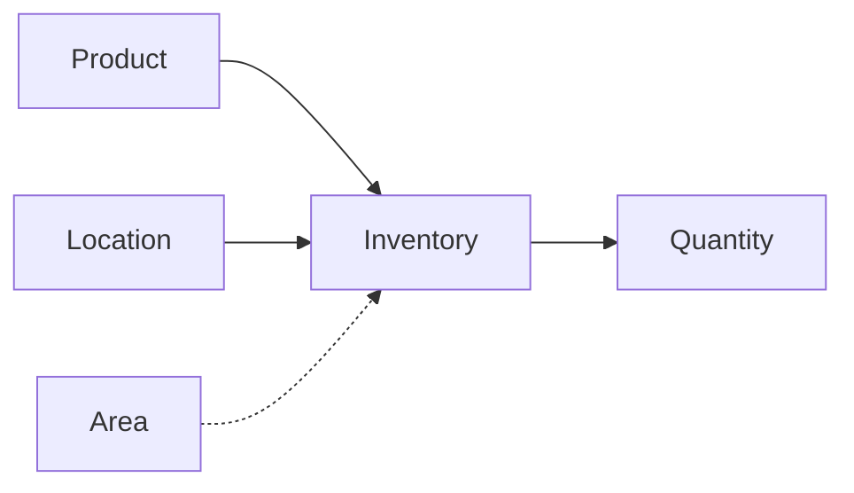

# Managing Inventory

Inventory tracks the quantity of products at specific locations and areas. It answers the question: "How many of this product are at this place?"

## Understanding the Inventory Model

- **Product** - What the item is (from the catalog)
- **Location** - Where items are stored (warehouse, supplier, etc.)
- **Area** - Optional specific placement (shelf, bin)
- **Quantity** - How many are at that location/area

!!! info "One Record Per Combination"
    Each unique combination of Product + Location + Area has one inventory record. Use the adjust endpoint to change quantities.

## Viewing Inventory

Navigate to the **Inventory** section from the sidebar.

The inventory list displays:

- **Product** - SKU and name
- **Location** - Where the inventory is
- **Area** - Specific placement (if set)
- **Quantity** - Current stock level
- **Expiry** - Expiration date (for perishables)

### Filtering Inventory

Filter inventory by:

- **Product** - Search by SKU or name
- **Location** - Filter by location
- **Area** - Filter by area
- **Low Stock** - Show items below reorder point
- **Expiring Soon** - Show items expiring within 30 days

## Adding Inventory

1. Click the **Add Inventory** button
2. Select a product
3. Select a location
4. Optionally select an area within that location
5. Enter the quantity and optional details

### Inventory Fields

| Field | Required | Description |
|-------|----------|-------------|
| Product | Yes | Product from catalog |
| Location | Yes | Storage location |
| Area | No | Specific area within location |
| Quantity | Yes | Number of items |
| Batch Number | No | Batch or lot number |
| Expiry Date | No | Expiration date |
| Cost per Unit | No | Purchase cost |
| Received Date | No | When inventory was received |

!!! warning "Duplicate Prevention"
    You cannot create two inventory records for the same product at the same location/area. Update the existing record instead.

## Adjusting Quantities

Use the **Adjust** feature to add or remove inventory:

1. Click the adjust button on an inventory row
2. Enter the adjustment amount:
   - Positive number to add (e.g., `+50`)
   - Negative number to remove (e.g., `-10`)
3. Click **Adjust** to apply

!!! tip "Adjustment vs Update"
    Use **Adjust** for incremental changes (received shipment, sold items). Use **Update** to set an absolute quantity (stock count corrections).

## Moving Inventory

To move inventory between locations:

1. **Reduce** quantity at the source location
2. **Add** or increase quantity at the destination location

!!! info "Future Feature"
    Direct inventory transfers between locations are planned for a future release.

## Low Stock Alerts

Products have a **reorder point** that triggers low stock alerts:

- Set on the product (e.g., reorder point = 10)
- When inventory quantity ≤ reorder point, it appears in low stock filter
- Use this to know when to reorder from suppliers

## Tracking Expiry Dates

For perishable items:

1. Set **Is Perishable** on the product
2. Enter **Expiry Date** when adding inventory
3. Use the "Expiring Soon" filter to see items expiring within 30 days

## Inventory at Multiple Locations

The same product can exist at multiple locations:

| Product | Location | Area | Quantity |
|---------|----------|------|----------|
| PROD-001 | Miami Warehouse | Shelf A1 | 50 |
| PROD-001 | Miami Warehouse | Shelf B2 | 25 |
| PROD-001 | Monaco Supplier | - | 100 |
| PROD-001 | Yacht Bella | - | 5 |

This lets you track:
- Warehouse stock by shelf
- Supplier inventory
- Items already delivered to clients

## Best Practices

1. **Use areas for large quantities** - Easier to find items during picking
2. **Track batch numbers** - Helps with recalls or quality issues
3. **Set reorder points** - Prevent stockouts
4. **Regular stock counts** - Adjust quantities to match physical counts
5. **Track expiry dates** - Especially for cosmetics and consumables
