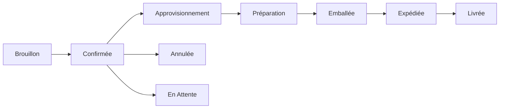

# Traitement des Commandes

Suivez les commandes d'approvisionnement des yachts tout au long de leur cycle de vie complet.

!!! note "Bientôt Disponible"
    Le module de gestion des commandes est actuellement en cours de développement. Consultez la [Feuille de Route](../roadmap.md) pour les fonctionnalités prévues.

## Flux de Travail des Commandes

Les commandes suivent ce cycle de vie :

### Statuts des Commandes

| Statut | Description |
|--------|-------------|
| Brouillon | La commande est en cours de préparation |
| Confirmée | La commande est confirmée et le traitement commence |
| Approvisionnement | Les articles sont en cours d'approvisionnement |
| Préparation | Les articles sont en cours de préparation |
| Emballée | Les articles sont emballés et prêts à l'expédition |
| Expédiée | La commande est en transit |
| Livrée | La commande a été livrée |
| Annulée | La commande a été annulée |
| En Attente | La commande est temporairement suspendue |

## Création d'une Commande

1. Accédez aux **Commandes**
2. Cliquez sur **Créer une Commande**
3. Remplissez les détails de la commande :
   - Informations client
   - Adresse de livraison
   - Nom du yacht
   - Date limite de livraison
4. Ajoutez les articles
5. Enregistrez comme brouillon ou confirmez

## Gestion des Articles de Commande

Chaque commande contient des articles avec :

- Référence produit
- Quantité commandée
- Prix unitaire
- Quantité préparée
- Quantité emballée

## Historique des Commandes

Toutes les modifications de commande sont suivies dans le journal d'audit :

- Changements de statut
- Ajouts/suppressions d'articles
- Modifications de quantité
- Changements d'affectation

## Fonctionnalités Prévues

- [ ] Création de bons de commande
- [ ] Intégration fournisseurs
- [ ] Mises à jour automatiques de l'inventaire
- [ ] Notifications par email
- [ ] Modèles de commande
