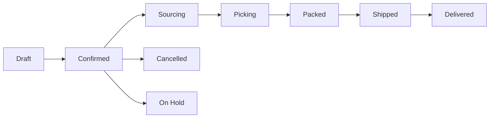

# Order Processing

Track yacht provisioning orders through their complete lifecycle.

!!! note "Coming Soon"
    The order management module is currently under development. See the [Roadmap](../roadmap.md) for planned features.

## Order Workflow

Orders follow this lifecycle:

### Order Statuses

| Status | Description |
|--------|-------------|
| Draft | Order is being prepared |
| Confirmed | Order is confirmed and processing begins |
| Sourcing | Items are being sourced from suppliers |
| Picking | Items are being picked from inventory |
| Packed | Items are packed and ready for shipping |
| Shipped | Order is in transit |
| Delivered | Order has been delivered |
| Cancelled | Order was cancelled |
| On Hold | Order is temporarily paused |

## Creating an Order

1. Navigate to **Orders**
2. Click **Create Order**
3. Fill in order details:
   - Client information
   - Delivery address
   - Yacht name
   - Delivery deadline
4. Add line items
5. Save as draft or confirm

## Managing Order Items

Each order contains line items with:

- Product reference
- Quantity ordered
- Unit price
- Quantity picked
- Quantity packed

## Order History

All order changes are tracked in the audit log:

- Status changes
- Item additions/removals
- Quantity changes
- Assignment changes

## Planned Features

- [ ] Purchase order creation
- [ ] Supplier integration
- [ ] Automatic inventory updates
- [ ] Email notifications
- [ ] Order templates
