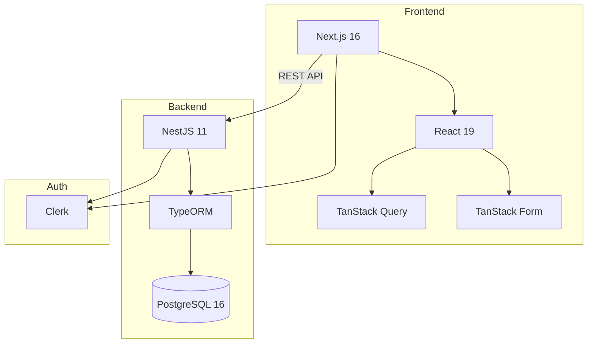

# MkDocs Material Documentation Implementation Plan

## Overview

Implement a comprehensive documentation site for the RBI Inventory System using MkDocs Material with:
- Multi-language support (English and French)
- UI screenshots for user documentation
- AWS S3 + CloudFront hosting (initially), with future bare metal migration
- Project roadmap based on GitHub issues
- Developer documentation for testing, code practices, and setup

## Current State Analysis

### Existing Documentation
- Scattered across CLAUDE.md files and READMEs (7 markdown files)
- No unified documentation generator
- No user-facing product documentation
- Existing `/docs/` folder contains only architecture diagram and a status report

### What's Missing
- Unified searchable documentation site
- Multi-language support
- User guides with screenshots
- Testing documentation
- Contributing guidelines
- Deployment documentation

### Key Discoveries
- App already supports i18n (EN/DE/FR) - docs should match
- 22 open GitHub issues provide roadmap content
- devenv.nix can be extended to serve docs locally
- Existing `docs/` folder can be repurposed for MkDocs

## Desired End State

A fully functional MkDocs Material documentation site with:
1. English (default) and French language versions
2. User guide with annotated screenshots
3. Developer documentation consolidated from CLAUDE.md files
4. Roadmap page linked to GitHub issues
5. Automated deployment to AWS on push to main
6. Local development server via `pnpm docs:dev`

### Verification
- `mkdocs build --strict` passes without warnings
- All pages accessible in both EN and FR
- Screenshots display correctly
- Language switcher works
- Site deployed and accessible via CloudFront URL

## What We're NOT Doing

- API endpoint documentation (already covered by OpenAPI/Swagger)
- Video tutorials (screenshots only for now)
- German translation (only EN/FR requested)
- Versioned documentation (single version)
- Custom MkDocs theme (using Material defaults)
- Bare metal deployment (AWS first, bare metal is future work)

## Implementation Approach

Use MkDocs Material with the `mkdocs-static-i18n` plugin for multi-language support. Structure translations using suffix-based naming (`index.md` for EN, `index.fr.md` for FR). Deploy to AWS S3 with CloudFront CDN using GitHub Actions with OIDC authentication.

---

## Phase 1: MkDocs Setup & Configuration

### Overview
Install MkDocs Material and configure the project for multi-language documentation.

### Changes Required

#### 1. Create Python requirements file
**File**: `requirements-docs.txt` (new file at repo root)

```txt
mkdocs-material>=9.5.0
mkdocs-static-i18n>=1.2.0
mkdocs-git-revision-date-localized-plugin>=1.2.0
```

#### 2. Create MkDocs configuration
**File**: `mkdocs.yml` (new file at repo root)

```yaml
site_name: RBI Inventory Documentation
site_description: Yacht provisioning inventory management system
site_url: https://docs.rbi-inventory.com
repo_url: https://github.com/maximilianpw/rbi-inventory
repo_name: maximilianpw/rbi-inventory
copyright: Copyright &copy; 2025 RBI Inventory

theme:
  name: material
  language: en
  palette:
    - scheme: default
      primary: indigo
      accent: indigo
      toggle:
        icon: material/brightness-7
        name: Switch to dark mode
    - scheme: slate
      primary: indigo
      accent: indigo
      toggle:
        icon: material/brightness-4
        name: Switch to light mode
  features:
    - navigation.tabs
    - navigation.sections
    - navigation.top
    - navigation.indexes
    - search.suggest
    - search.highlight
    - content.code.copy
    - content.tabs.link
  icon:
    repo: fontawesome/brands/github

plugins:
  - search:
      lang:
        - en
        - fr
  - i18n:
      docs_structure: suffix
      fallback_to_default: true
      reconfigure_material: true
      reconfigure_search: true
      languages:
        - locale: en
          default: true
          name: English
          build: true
          site_name: "RBI Inventory Documentation"
          site_description: "Yacht provisioning inventory management system"
        - locale: fr
          name: Français
          build: true
          site_name: "Documentation RBI Inventory"
          site_description: "Système de gestion d'inventaire pour yachts"
          nav_translations:
            Home: Accueil
            Getting Started: Démarrage
            Installation: Installation
            Quick Start: Démarrage rapide
            Configuration: Configuration
            User Guide: Guide Utilisateur
            Overview: Aperçu
            Products: Produits
            Categories: Catégories
            Orders: Commandes
            Audit Logs: Journaux d'audit
            Development: Développement
            Architecture: Architecture
            Setup: Configuration
            Code Style: Style de code
            Testing: Tests
            API Development: Développement API
            Frontend Development: Développement Frontend
            CI/CD: CI/CD
            Contributing: Contribuer
            Guidelines: Directives
            Pull Requests: Pull Requests
            Roadmap: Feuille de route
            Reference: Référence
            Environment Variables: Variables d'environnement
            CLI Commands: Commandes CLI
            Troubleshooting: Dépannage
          admonition_translations:
            note: Note
            abstract: Résumé
            info: Info
            tip: Conseil
            success: Succès
            question: Question
            warning: Avertissement
            failure: Échec
            danger: Danger
            bug: Bug
            example: Exemple
            quote: Citation
  - git-revision-date-localized:
      enable_creation_date: true
      type: date

markdown_extensions:
  - admonition
  - pymdownx.details
  - pymdownx.superfences:
      custom_fences:
        - name: mermaid
          class: mermaid
          format: !!python/name:pymdownx.superfences.fence_code_format
  - pymdownx.highlight:
      anchor_linenums: true
  - pymdownx.inlinehilite
  - pymdownx.snippets
  - pymdownx.tabbed:
      alternate_style: true
  - attr_list
  - md_in_html
  - tables
  - toc:
      permalink: true

extra:
  social:
    - icon: fontawesome/brands/github
      link: https://github.com/maximilianpw/rbi-inventory

nav:
  - Home: index.md
  - Getting Started:
      - getting-started/index.md
      - Installation: getting-started/installation.md
      - Quick Start: getting-started/quick-start.md
      - Configuration: getting-started/configuration.md
  - User Guide:
      - user-guide/index.md
      - Products: user-guide/products.md
      - Categories: user-guide/categories.md
      - Orders: user-guide/orders.md
      - Audit Logs: user-guide/audit-logs.md
  - Development:
      - development/index.md
      - Architecture: development/architecture.md
      - Setup: development/setup.md
      - Code Style: development/code-style.md
      - Testing: development/testing.md
      - API Development: development/api-development.md
      - Frontend Development: development/frontend-development.md
      - CI/CD: development/ci-cd.md
  - Contributing:
      - contributing/index.md
      - Guidelines: contributing/guidelines.md
      - Pull Requests: contributing/pull-requests.md
  - Roadmap: roadmap.md
  - Reference:
      - reference/index.md
      - Environment Variables: reference/environment-variables.md
      - CLI Commands: reference/cli-commands.md
      - Troubleshooting: reference/troubleshooting.md
```

#### 3. Update devenv.nix for docs development
**File**: `devenv.nix`
**Changes**: Add Python and docs process

```nix
# Add to packages list (around line 16-22)
packages = [
  pkgs.just
  pkgs.docker
  pkgs.docker-compose
  pkgs.typescript
  pkgs.nodePackages.prettier
  pkgs.python312          # Add Python for MkDocs
  pkgs.python312Packages.pip
];

# Add new process (around line 45-46)
processes.docs.exec = "cd ${config.env.DEVENV_ROOT} && pip install -q -r requirements-docs.txt && mkdocs serve -a 127.0.0.1:8000";
```

#### 4. Add npm scripts for docs
**File**: `package.json`
**Changes**: Add docs scripts

```json
{
  "scripts": {
    "docs:install": "pip install -r requirements-docs.txt",
    "docs:dev": "mkdocs serve",
    "docs:build": "mkdocs build --strict",
    "docs:deploy": "mkdocs build --strict"
  }
}
```

#### 5. Create docs directory structure
**Commands**:
```bash
mkdir -p docs/{getting-started,user-guide,development,contributing,reference}
mkdir -p docs/assets/{screenshots,images}
```

### Success Criteria

#### Automated Verification:
- [ ] `pip install -r requirements-docs.txt` completes without errors
- [ ] `mkdocs build --strict` completes without errors
- [ ] `mkdocs serve` starts successfully on port 8000

#### Manual Verification:
- [ ] Documentation site accessible at http://localhost:8000
- [ ] Language switcher visible in header
- [ ] Dark/light mode toggle works

---

## Phase 2: Documentation Content Structure

### Overview
Create the markdown file structure with English content and French placeholders.

### Changes Required

#### 1. Home page
**File**: `docs/index.md`

```markdown
# RBI Inventory System

Welcome to the RBI Inventory documentation. This system helps manage yacht provisioning inventory with features for product management, order tracking, and audit logging.

## Quick Links

<div class="grid cards" markdown>

- :material-rocket-launch: **Getting Started**

    Get up and running with RBI Inventory in minutes.

    [:octicons-arrow-right-24: Installation](getting-started/installation.md)

- :material-book-open-variant: **User Guide**

    Learn how to use all features of the application.

    [:octicons-arrow-right-24: User Guide](user-guide/index.md)

- :material-code-braces: **Development**

    Set up your development environment and contribute.

    [:octicons-arrow-right-24: Development](development/index.md)

- :material-map: **Roadmap**

    See what's planned for future releases.

    [:octicons-arrow-right-24: Roadmap](roadmap.md)

</div>

## Features

- **Product Management** - Create and organize products with SKUs, pricing, and categories
- **Category Hierarchy** - Multi-level categorization with unlimited nesting
- **Order Processing** - Track yacht provisioning orders through complete lifecycle
- **Audit Trail** - Complete change history with user tracking
- **Multi-language** - English, German, and French support
- **QR Scanning** - Barcode scanning for quick product lookup
```

**File**: `docs/index.fr.md`

```markdown
# Système d'Inventaire RBI

Bienvenue dans la documentation RBI Inventory. Ce système aide à gérer l'inventaire d'approvisionnement des yachts avec des fonctionnalités de gestion des produits, de suivi des commandes et de journalisation des audits.

## Liens Rapides

<div class="grid cards" markdown>

- :material-rocket-launch: **Démarrage**

    Commencez avec RBI Inventory en quelques minutes.

    [:octicons-arrow-right-24: Installation](getting-started/installation.md)

- :material-book-open-variant: **Guide Utilisateur**

    Apprenez à utiliser toutes les fonctionnalités de l'application.

    [:octicons-arrow-right-24: Guide Utilisateur](user-guide/index.md)

- :material-code-braces: **Développement**

    Configurez votre environnement de développement et contribuez.

    [:octicons-arrow-right-24: Développement](development/index.md)

- :material-map: **Feuille de Route**

    Découvrez ce qui est prévu pour les prochaines versions.

    [:octicons-arrow-right-24: Feuille de Route](roadmap.md)

</div>

## Fonctionnalités

- **Gestion des Produits** - Créez et organisez des produits avec SKUs, prix et catégories
- **Hiérarchie des Catégories** - Catégorisation multi-niveaux avec imbrication illimitée
- **Traitement des Commandes** - Suivez les commandes d'approvisionnement des yachts
- **Piste d'Audit** - Historique complet des modifications avec suivi des utilisateurs
- **Multi-langue** - Support anglais, allemand et français
- **Scan QR** - Numérisation de codes-barres pour une recherche rapide des produits
```

#### 2. Section index files
Create index files for each section. Example for Getting Started:

**File**: `docs/getting-started/index.md`

```markdown
# Getting Started

This section will help you get RBI Inventory up and running.

## Prerequisites

Before you begin, ensure you have:

- Node.js >= 20.0.0
- pnpm >= 10.0.0
- Nix with flakes enabled (for devenv)
- PostgreSQL 16 (provided by devenv)

## Next Steps

1. [Installation](installation.md) - Set up the development environment
2. [Quick Start](quick-start.md) - Create your first products
3. [Configuration](configuration.md) - Configure environment variables
```

#### 3. Create placeholder files for all sections

Create empty placeholder files that will be filled in Phase 3 and 4:

```bash
# Getting Started
touch docs/getting-started/{installation,quick-start,configuration}.md

# User Guide
touch docs/user-guide/{index,products,categories,orders,audit-logs}.md

# Development
touch docs/development/{index,architecture,setup,code-style,testing,api-development,frontend-development,ci-cd}.md

# Contributing
touch docs/contributing/{index,guidelines,pull-requests}.md

# Reference
touch docs/reference/{index,environment-variables,cli-commands,troubleshooting}.md

# Roadmap
touch docs/roadmap.md
```

### Success Criteria

#### Automated Verification:
- [ ] `mkdocs build --strict` passes with no missing page warnings
- [ ] All navigation links resolve correctly

#### Manual Verification:
- [ ] All sections visible in navigation
- [ ] Language switcher switches between EN/FR
- [ ] French pages show French navigation labels

---

## Phase 3: User Guide with Screenshots

### Overview
Create user documentation with annotated screenshots showing key workflows.

### Changes Required

#### 1. Screenshot capture process
Screenshots should be captured at 1920x1080 resolution with browser dev tools.

**Directory structure**:
```
docs/assets/screenshots/
├── products/
│   ├── product-list.png
│   ├── product-form.png
│   ├── qr-scanner.png
│   └── product-list.fr.png  # French UI screenshots if different
├── categories/
│   ├── category-tree.png
│   └── category-form.png
├── orders/
│   └── order-workflow.png
└── audit-logs/
    └── audit-log-table.png
```

#### 2. Products user guide
**File**: `docs/user-guide/products.md`

```markdown
# Managing Products

Products are the core of the RBI Inventory system. Each product represents an item in your yacht provisioning inventory.

## Viewing Products

Navigate to the **Products** section from the sidebar to see all products.


The product list displays:

- **SKU** - Unique product identifier
- **Name** - Product name
- **Category** - Product category
- **Price** - Standard selling price
- **Status** - Active or inactive

!!! tip "Filtering Products"
    Use the category sidebar to filter products by category. Click on a category to show only products in that category and its subcategories.

## Creating a Product

1. Click the **Create Product** button
2. Fill in the required fields:
   - **SKU** - Unique identifier (can be scanned via QR code)
   - **Name** - Product name
   - **Category** - Select from the category tree
   - **Reorder Point** - Minimum stock level for alerts


### Using the QR Scanner

Click the QR code icon next to the SKU field to scan a barcode:


1. Allow camera access when prompted
2. Point camera at the barcode
3. SKU will be automatically filled

## Editing Products

1. Click on a product row to open the edit form
2. Modify the fields as needed
3. Click **Save** to apply changes

!!! warning "SKU Changes"
    Changing a product's SKU may affect existing orders and inventory records. Use caution when modifying SKUs.

## Bulk Operations

Select multiple products using the checkboxes to perform bulk actions:

- **Bulk Status Update** - Activate or deactivate multiple products
- **Bulk Delete** - Soft delete multiple products
- **Bulk Restore** - Restore deleted products
```

**File**: `docs/user-guide/products.fr.md`

```markdown
# Gestion des Produits

Les produits sont au cœur du système RBI Inventory. Chaque produit représente un article dans votre inventaire d'approvisionnement de yacht.

## Affichage des Produits

Accédez à la section **Produits** depuis la barre latérale pour voir tous les produits.


La liste des produits affiche :

- **SKU** - Identifiant unique du produit
- **Nom** - Nom du produit
- **Catégorie** - Catégorie du produit
- **Prix** - Prix de vente standard
- **Statut** - Actif ou inactif

!!! tip "Filtrage des Produits"
    Utilisez la barre latérale des catégories pour filtrer les produits par catégorie. Cliquez sur une catégorie pour afficher uniquement les produits de cette catégorie et de ses sous-catégories.

## Création d'un Produit

1. Cliquez sur le bouton **Créer un Produit**
2. Remplissez les champs obligatoires :
   - **SKU** - Identifiant unique (peut être scanné via code QR)
   - **Nom** - Nom du produit
   - **Catégorie** - Sélectionnez dans l'arborescence des catégories
   - **Point de Réapprovisionnement** - Niveau de stock minimum pour les alertes


### Utilisation du Scanner QR

Cliquez sur l'icône de code QR à côté du champ SKU pour scanner un code-barres :


1. Autorisez l'accès à la caméra lorsque demandé
2. Pointez la caméra vers le code-barres
3. Le SKU sera automatiquement rempli

## Modification des Produits

1. Cliquez sur une ligne de produit pour ouvrir le formulaire de modification
2. Modifiez les champs selon vos besoins
3. Cliquez sur **Enregistrer** pour appliquer les modifications

!!! warning "Modifications de SKU"
    La modification du SKU d'un produit peut affecter les commandes et les enregistrements d'inventaire existants. Soyez prudent lors de la modification des SKUs.
```

#### 3. Similar structure for other user guide pages
Create similar documentation for:
- `categories.md` / `categories.fr.md` - Category tree management
- `orders.md` / `orders.fr.md` - Order workflow
- `audit-logs.md` / `audit-logs.fr.md` - Viewing audit history

### Success Criteria

#### Automated Verification:
- [ ] `mkdocs build --strict` passes with no broken image links
- [ ] All referenced screenshots exist in `docs/assets/screenshots/`

#### Manual Verification:
- [ ] Screenshots display correctly at appropriate sizes
- [ ] Annotations and callouts are clear
- [ ] French translations are accurate and natural
- [ ] Screenshots match current UI state

---

## Phase 4: Developer Documentation

### Overview
Consolidate existing documentation from CLAUDE.md files into the developer section.

### Changes Required

#### 1. Architecture documentation
**File**: `docs/development/architecture.md`

Migrate content from `/CLAUDE.md` architecture section with Mermaid diagrams:

```markdown
# Architecture

## System Overview



## Tech Stack

| Layer | Technology |
|-------|------------|
| Frontend | Next.js 16, React 19, TanStack Query/Form, Tailwind CSS |
| Backend | NestJS 11, TypeORM, PostgreSQL 16 |
| Auth | Clerk |
| API Docs | OpenAPI/Swagger |
| Tooling | pnpm workspaces, devenv.sh, TypeScript |

## Monorepo Structure

...
```

#### 2. Testing documentation
**File**: `docs/development/testing.md`

Consolidate testing information from research:

```markdown
# Testing

## Overview

The RBI Inventory system uses Jest for backend testing. Frontend testing is planned but not yet implemented.

## Backend Testing

### Running Tests

```bash
# Run all unit tests
pnpm --filter @rbi/api test

# Run tests in watch mode
pnpm --filter @rbi/api test:watch

# Run tests with coverage
pnpm --filter @rbi/api test:cov

# Run end-to-end tests
pnpm --filter @rbi/api test:e2e
```

### Test Structure

- **Unit tests**: Colocated with source files as `*.spec.ts`
- **E2E tests**: Located in `modules/api/test/*.e2e-spec.ts`

### Writing Unit Tests

Example service test pattern:

```typescript
describe('ProductsService', () => {
  let service: ProductsService;
  let productRepository: jest.Mocked<ProductRepository>;

  beforeEach(async () => {
    const module = await Test.createTestingModule({
      providers: [
        ProductsService,
        {
          provide: ProductRepository,
          useValue: {
            findAllPaginated: jest.fn(),
            create: jest.fn(),
            // ... other methods
          },
        },
      ],
    }).compile();

    service = module.get(ProductsService);
    productRepository = module.get(ProductRepository);
  });

  it('should create a product', async () => {
    // Test implementation
  });
});
```

...
```

#### 3. Code style documentation
**File**: `docs/development/code-style.md`

Document ESLint/Prettier configuration and naming conventions.

#### 4. Setup documentation
**File**: `docs/development/setup.md`

Consolidate setup instructions from various READMEs.

### Success Criteria

#### Automated Verification:
- [ ] `mkdocs build --strict` passes
- [ ] All code blocks have syntax highlighting
- [ ] Mermaid diagrams render correctly

#### Manual Verification:
- [ ] Documentation matches current codebase patterns
- [ ] Commands are accurate and work as documented
- [ ] No duplicate content across pages

---

## Phase 5: Roadmap Section

### Overview
Create a roadmap page organized by GitHub issues.

### Changes Required

#### 1. Roadmap page
**File**: `docs/roadmap.md`

```markdown
# Roadmap

This roadmap outlines planned features and improvements for RBI Inventory. Items are tracked as [GitHub Issues](https://github.com/maximilianpw/rbi-inventory/issues).

## Completed

- [x] Categories management API ([#40](https://github.com/maximilianpw/rbi-inventory/issues/40))
- [x] User authentication UI with Clerk ([#45](https://github.com/maximilianpw/rbi-inventory/issues/45))
- [x] Categories and Locations management UI ([#46](https://github.com/maximilianpw/rbi-inventory/issues/46))
- [x] Code quality tools and linting ([#57](https://github.com/maximilianpw/rbi-inventory/issues/57))
- [x] CI/CD pipeline with GitHub Actions ([#58](https://github.com/maximilianpw/rbi-inventory/issues/58))
- [x] Mobile-responsive PWA features ([#63](https://github.com/maximilianpw/rbi-inventory/issues/63))

## In Progress

### Core Features

| Feature | Issue | Description |
|---------|-------|-------------|
| Inventory Items CRUD | [#39](https://github.com/maximilianpw/rbi-inventory/issues/39) | Full CRUD operations for inventory items |
| Locations API | [#41](https://github.com/maximilianpw/rbi-inventory/issues/41) | Location/storage area management |
| Suppliers API | [#42](https://github.com/maximilianpw/rbi-inventory/issues/42) | Supplier/vendor management |
| Inventory Items UI | [#43](https://github.com/maximilianpw/rbi-inventory/issues/43) | Frontend interface for inventory |
| RBAC | [#44](https://github.com/maximilianpw/rbi-inventory/issues/44) | Role-based access control |

### Inventory Management

| Feature | Issue | Description |
|---------|-------|-------------|
| Transaction History | [#47](https://github.com/maximilianpw/rbi-inventory/issues/47) | Track all inventory changes |
| Low Stock Alerts | [#48](https://github.com/maximilianpw/rbi-inventory/issues/48) | Notifications for low stock |
| Advanced Search API | [#49](https://github.com/maximilianpw/rbi-inventory/issues/49) | Full-text search and filtering |
| Advanced Search UI | [#50](https://github.com/maximilianpw/rbi-inventory/issues/50) | Search interface with filters |
| QR/Barcode Scanning | [#51](https://github.com/maximilianpw/rbi-inventory/issues/51) | Barcode scanning support |
| Dashboard Analytics | [#52](https://github.com/maximilianpw/rbi-inventory/issues/52) | Inventory metrics and charts |
| Reporting & Export | [#53](https://github.com/maximilianpw/rbi-inventory/issues/53) | CSV, PDF, Excel export |
| Bulk Operations | [#54](https://github.com/maximilianpw/rbi-inventory/issues/54) | Bulk update/delete/import |
| Expiration Tracking | [#65](https://github.com/maximilianpw/rbi-inventory/issues/65) | Track perishable expiration dates |

### Orders & Procurement

| Feature | Issue | Description |
|---------|-------|-------------|
| Ordering System | [#64](https://github.com/maximilianpw/rbi-inventory/issues/64) | Purchase orders and requisitions |

### Testing & Quality

| Feature | Issue | Description |
|---------|-------|-------------|
| API Unit/Integration Tests | [#55](https://github.com/maximilianpw/rbi-inventory/issues/55) | Backend test suite |
| E2E Tests (Playwright) | [#56](https://github.com/maximilianpw/rbi-inventory/issues/56) | Frontend E2E testing |

### Infrastructure

| Feature | Issue | Description |
|---------|-------|-------------|
| Production Deployment | [#59](https://github.com/maximilianpw/rbi-inventory/issues/59) | Docker + hosting setup |
| Logging & Monitoring | [#60](https://github.com/maximilianpw/rbi-inventory/issues/60) | Production observability |
| Database Backup | [#61](https://github.com/maximilianpw/rbi-inventory/issues/61) | Backup and recovery |
| Documentation | [#62](https://github.com/maximilianpw/rbi-inventory/issues/62) | Comprehensive docs (this!) |
| Getting Started Guide | [#66](https://github.com/maximilianpw/rbi-inventory/issues/66) | Sample data and onboarding |

## Contributing

Want to help? Check the [Contributing Guide](contributing/guidelines.md) and pick an issue from the list above!
```

**File**: `docs/roadmap.fr.md`

```markdown
# Feuille de Route

Cette feuille de route présente les fonctionnalités et améliorations prévues pour RBI Inventory. Les éléments sont suivis comme [Issues GitHub](https://github.com/maximilianpw/rbi-inventory/issues).

## Terminé

- [x] API de gestion des catégories ([#40](https://github.com/maximilianpw/rbi-inventory/issues/40))
- [x] Interface d'authentification avec Clerk ([#45](https://github.com/maximilianpw/rbi-inventory/issues/45))
- [x] Interface de gestion des catégories et emplacements ([#46](https://github.com/maximilianpw/rbi-inventory/issues/46))
- [x] Outils de qualité de code et linting ([#57](https://github.com/maximilianpw/rbi-inventory/issues/57))
- [x] Pipeline CI/CD avec GitHub Actions ([#58](https://github.com/maximilianpw/rbi-inventory/issues/58))
- [x] Fonctionnalités PWA responsive mobile ([#63](https://github.com/maximilianpw/rbi-inventory/issues/63))

## En Cours

### Fonctionnalités Principales

| Fonctionnalité | Issue | Description |
|----------------|-------|-------------|
| CRUD Articles d'Inventaire | [#39](https://github.com/maximilianpw/rbi-inventory/issues/39) | Opérations CRUD complètes |
| API Emplacements | [#41](https://github.com/maximilianpw/rbi-inventory/issues/41) | Gestion des zones de stockage |
| API Fournisseurs | [#42](https://github.com/maximilianpw/rbi-inventory/issues/42) | Gestion des fournisseurs |
| Interface Inventaire | [#43](https://github.com/maximilianpw/rbi-inventory/issues/43) | Interface frontend |
| Contrôle d'Accès | [#44](https://github.com/maximilianpw/rbi-inventory/issues/44) | Contrôle d'accès basé sur les rôles |

...

## Contribuer

Vous voulez aider ? Consultez le [Guide de Contribution](contributing/guidelines.md) et choisissez une issue dans la liste ci-dessus !
```

### Success Criteria

#### Automated Verification:
- [ ] `mkdocs build --strict` passes
- [ ] All GitHub links are valid (external links)

#### Manual Verification:
- [ ] Roadmap categories make sense
- [ ] Issue links open correctly
- [ ] French translation is accurate

---

## Phase 6: CI/CD & AWS Deployment

### Overview
Set up GitHub Actions for automated documentation deployment to AWS S3 + CloudFront.

### Changes Required

#### 1. GitHub Actions workflow
**File**: `.github/workflows/deploy-docs.yml`

```yaml
name: Deploy Documentation

on:
  push:
    branches:
      - main
    paths:
      - 'docs/**'
      - 'mkdocs.yml'
      - 'requirements-docs.txt'
      - '.github/workflows/deploy-docs.yml'
  workflow_dispatch:

permissions:
  id-token: write
  contents: read

jobs:
  build-and-deploy:
    runs-on: ubuntu-latest

    steps:
      - name: Checkout repository
        uses: actions/checkout@v4
        with:
          fetch-depth: 0  # Needed for git-revision-date plugin

      - name: Set up Python
        uses: actions/setup-python@v5
        with:
          python-version: '3.12'
          cache: 'pip'
          cache-dependency-path: 'requirements-docs.txt'

      - name: Install dependencies
        run: pip install -r requirements-docs.txt

      - name: Build documentation
        run: mkdocs build --strict

      - name: Configure AWS credentials
        uses: aws-actions/configure-aws-credentials@v4
        with:
          role-to-assume: ${{ secrets.AWS_DOCS_ROLE_ARN }}
          aws-region: us-east-1

      - name: Sync to S3
        run: |
          aws s3 sync site/ s3://${{ secrets.DOCS_S3_BUCKET }} \
            --delete \
            --cache-control "public, max-age=3600"

      - name: Invalidate CloudFront cache
        run: |
          aws cloudfront create-invalidation \
            --distribution-id ${{ secrets.DOCS_CLOUDFRONT_DISTRIBUTION_ID }} \
            --paths "/*"
```

#### 2. AWS Infrastructure Setup (Manual or IaC)

**S3 Bucket Configuration**:
- Bucket name: `rbi-inventory-docs`
- Block all public access: Yes
- Versioning: Optional
- Object ownership: Bucket owner enforced

**CloudFront Distribution**:
- Origin: S3 bucket (REST API endpoint, not website endpoint)
- Origin Access Control: Create new OAC
- Viewer protocol policy: Redirect HTTP to HTTPS
- Default root object: `index.html`
- Custom domain: `docs.rbi-inventory.com` (optional)
- SSL certificate: ACM certificate in us-east-1

**CloudFront Function for index.html routing**:
```javascript
function handler(event) {
  var request = event.request;
  var uri = request.uri;

  if (!uri.includes('.') && !uri.endsWith('/')) {
    return {
      statusCode: 301,
      statusDescription: 'Moved Permanently',
      headers: { 'location': { value: uri + '/' } }
    };
  }

  if (uri.endsWith('/')) {
    request.uri += 'index.html';
  }

  return request;
}
```

**IAM Role for GitHub Actions (OIDC)**:
```json
{
  "Version": "2012-10-17",
  "Statement": [
    {
      "Effect": "Allow",
      "Principal": {
        "Federated": "arn:aws:iam::ACCOUNT_ID:oidc-provider/token.actions.githubusercontent.com"
      },
      "Action": "sts:AssumeRoleWithWebIdentity",
      "Condition": {
        "StringEquals": {
          "token.actions.githubusercontent.com:aud": "sts.amazonaws.com"
        },
        "StringLike": {
          "token.actions.githubusercontent.com:sub": "repo:maximilianpw/rbi-inventory:*"
        }
      }
    }
  ]
}
```

**IAM Policy**:
```json
{
  "Version": "2012-10-17",
  "Statement": [
    {
      "Effect": "Allow",
      "Action": ["s3:PutObject", "s3:GetObject", "s3:DeleteObject", "s3:ListBucket"],
      "Resource": [
        "arn:aws:s3:::rbi-inventory-docs",
        "arn:aws:s3:::rbi-inventory-docs/*"
      ]
    },
    {
      "Effect": "Allow",
      "Action": "cloudfront:CreateInvalidation",
      "Resource": "arn:aws:cloudfront::ACCOUNT_ID:distribution/DISTRIBUTION_ID"
    }
  ]
}
```

#### 3. GitHub Secrets Required

| Secret | Value |
|--------|-------|
| `AWS_DOCS_ROLE_ARN` | `arn:aws:iam::ACCOUNT_ID:role/GitHubActionsDocsRole` |
| `DOCS_S3_BUCKET` | `rbi-inventory-docs` |
| `DOCS_CLOUDFRONT_DISTRIBUTION_ID` | `E1234567890ABC` |

### Success Criteria

#### Automated Verification:
- [ ] GitHub Actions workflow runs successfully on push to main
- [ ] `mkdocs build --strict` passes in CI
- [ ] S3 sync completes without errors
- [ ] CloudFront invalidation completes

#### Manual Verification:
- [ ] Documentation accessible at CloudFront URL
- [ ] All pages load correctly with HTTPS
- [ ] Language switching works in production
- [ ] Search functionality works
- [ ] Images and screenshots display correctly

---

## Testing Strategy

### Build Testing
- Run `mkdocs build --strict` to catch broken links and missing files
- Validate YAML syntax in `mkdocs.yml`

### Content Testing
- Verify all internal links work
- Check all images exist and display correctly
- Validate code blocks have proper syntax highlighting

### Manual Testing Steps
1. Start local server with `mkdocs serve`
2. Navigate through all pages in both EN and FR
3. Test language switcher on each page
4. Verify dark/light mode toggle
5. Test search functionality
6. Check mobile responsiveness
7. Verify external links (GitHub issues) work

---

## Performance Considerations

- Images should be optimized (use WebP or compressed PNG)
- Screenshots should be reasonable size (< 500KB each)
- CloudFront caching enabled with 1-hour TTL for HTML, longer for assets
- Enable CloudFront compression for text files

---

## Migration Notes

### Existing docs folder
The current `/docs/` folder contains:
- `architecture/diagram.md` - Can be migrated to `development/architecture.md`
- `reports/2025-11-26.md` - Can be archived or moved to a `reports/` section

### CLAUDE.md files
Content from these files will be incorporated into developer documentation:
- `/CLAUDE.md` → `development/architecture.md`, `development/setup.md`
- `/modules/api/CLAUDE.md` → `development/api-development.md`
- `/modules/web/CLAUDE.md` → `development/frontend-development.md`
- `/.github/README.md` → `development/ci-cd.md`

---

## References

- Research document: `thoughts/shared/research/2025-12-25-mkdocs-documentation-research.md`
- MkDocs Material: https://squidfunk.github.io/mkdocs-material/
- mkdocs-static-i18n: https://ultrabug.github.io/mkdocs-static-i18n/
- GitHub Issues: https://github.com/maximilianpw/rbi-inventory/issues
